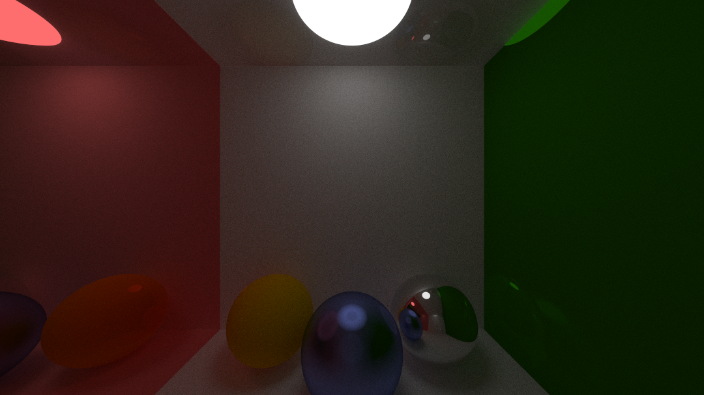

# C# Ray Tracer 

A multithreaded raytracer written in C# by following the [Ray Tracing In One Weekend Book](https://raytracing.github.io/).

Current Features:
- Global Illumination
- Multiple material types:
    - Lambertian
    - Metal
    - DiffuseLight
- Multithreaded progressive rendering pipeline (using .NET's Tasks)
- Random ray bouncing with pixel multisampling to best estimate colour.
- A UI made with C# Raylib and RayGUI bindings

## Compiling and Running

The project was built and tested with dotnet version `9.0.110`. 

To run the project in Visual Studio click on File > New > Project From Existing Code. 

If working in VSCode or a different text editor, simply run `dotnet run` (with -c Release flag to remove debugging slugishness).

## Render Showcases

